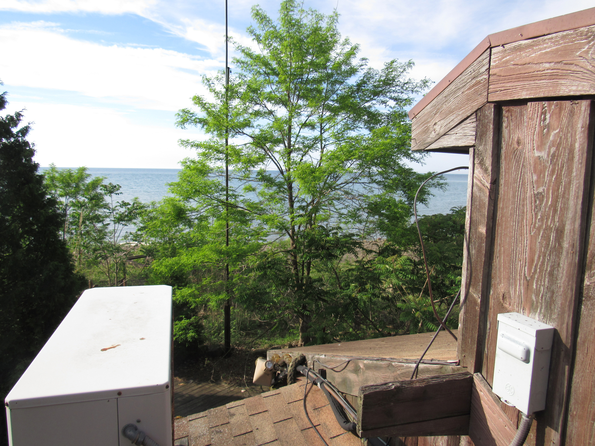
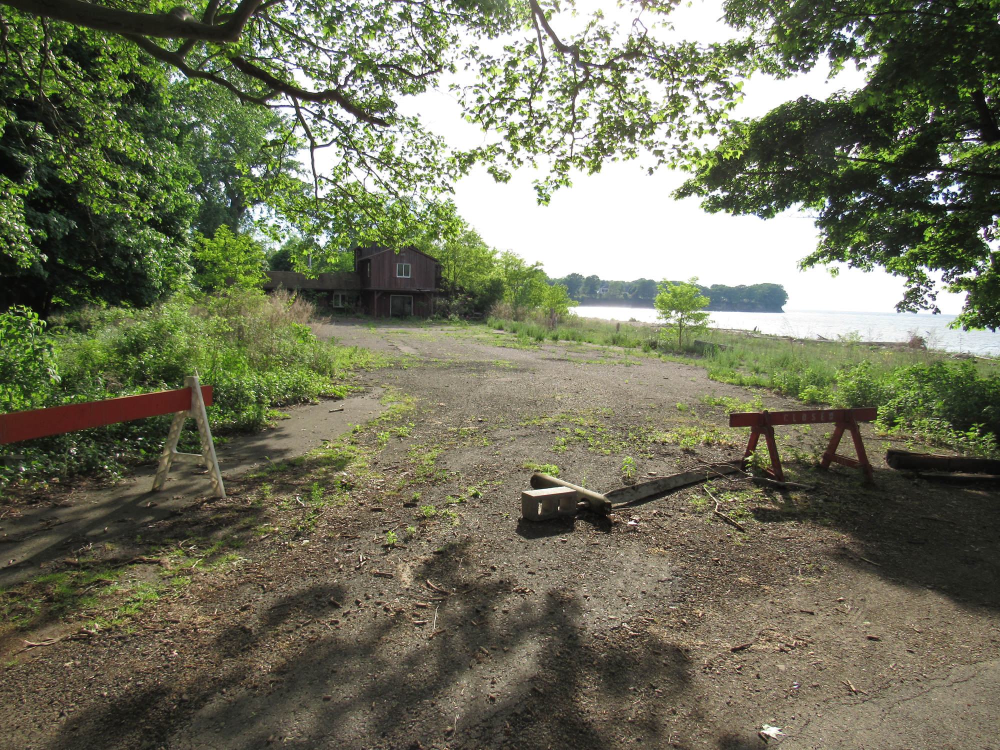
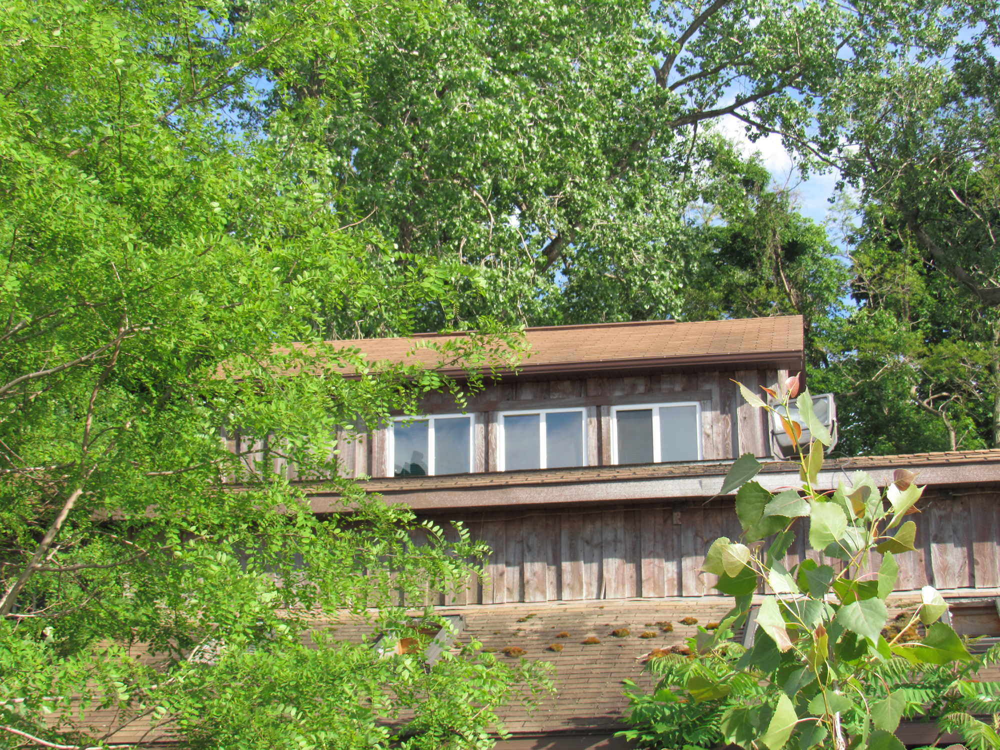
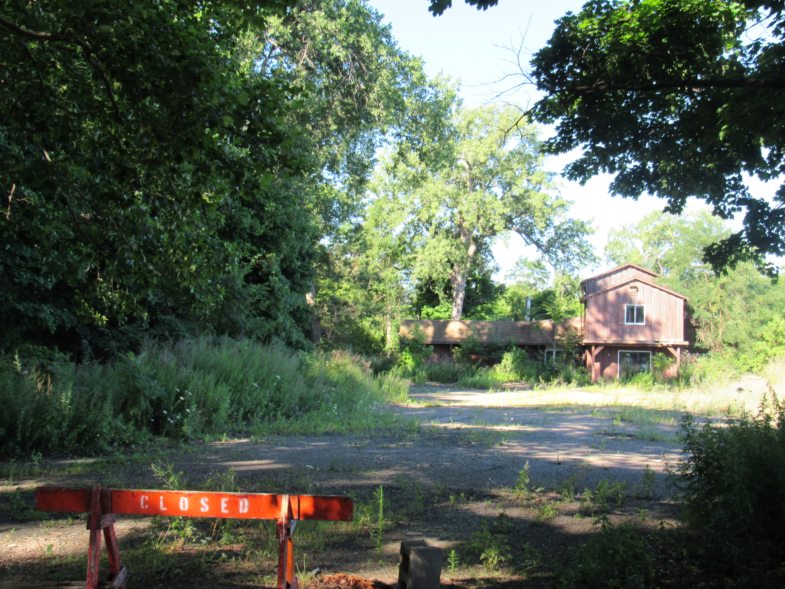

# Invitation for Expression of Interest (EOI)

The Chautauqua County Land Bank Corporation (CCLBC) and the Village of Silver Creek, NY seek expressions of interest for 42 Lake Ave, previously home to Hide Away Bay Restaurant, a historically popular restaurant and beach bar which was operated from 1972-2001.

The parcel is located on a picturesque, secluded beach with natural barriers on three sides. The northern parcel line is Lake Erie; the eastern parcel boundary is wooded and abuts a residential property; the southern parcel line abuts a sizeable, historic but active railroad berm and trestle; and the western parcel line is Walnut Creek. The site is accessed by a private driveway connected to Lake Avenue. It is zoned commercial for ease of re-development, and the Land Bank does have funds available to assist with demolition activities if appropriate. There exist wetlands, a flood plain, and coastal hazard area considerations on the parcel. Please see the supplemental survey for more information.

  

    
  
  
  

    
0.0

    
  

  
Acres of pristine waterfront property

  

    
  
  
  

    
000

    
  

  
Feet of lake frontage

  

    
  
  
  

    
000

    
  

  
Feet of frontage on Walnut Creek

The ideal development proposal would feature a water-dependent mixed-use facility consistent with a developing Local Waterfront Revitalization Program with amenities for both public and private use of the site. Responsible development of the natural setting, environmental stewardship, and consideration for the residential neighbors are desired. The Department of Environmental Conservation has participated in our pre-development planning, and will assist where necessary with plan reviews and process facilitation as the site is located within a Coastal Erosion Hazard Area per Environmental Conservation Law (ECL) Article 34.  The construction or placement of a structure, or any action or use of land which materially alters the condition of land, including grading, excavating, dumping, mining, dredging, filling or any disturbance of soil is a regulated activity requiring a [Coastal Erosion Management Permit](http://www.dec.ny.gov/permits/86547.html).

The CCLBC is soliciting Expressions of Interest outlining conceptual project ideas for this parcel. Submissions are due to the Land Bank by August 30, 2017, and the following information is requested:

* Conceptual project description: Provide a brief conceptual description of the project, including type of improvements, potential for revenue generation, and other benefits to the community.
* Project/site suitability: Describe why 42 Lake Ave is best suited for this conceptual project. Include a description of which portions of the parcel, if not the entire site, would be utilized. Describe any site or regulatory challenges and how this project could overcome them.
* Cost and financing: Provide preliminary budget, including purchase price and development costs, how this project may be funded and identify potential sources of financing/funding, if known.
* Timeline: An approximate timeline for the project development and completion should be presented.
* Stakeholder consideration: Identify stakeholder engagement process and/or past community plans taken into consideration when developing the project.
* Profile of team or partnership: Provide an overview of developer capabilities, experience with similar projects, and brief description of the team or any potential partners, if known. Letters of support from other stakeholders or organizations may be attached to the Letter of Interest.

# Interactive Photo Map:

<iframe width="100%" height="620" frameborder="0" style="padding:20px;" src="https://orbitist.space/maps/launch/embed/?mapid=6955&mode=embed#18.36/42.54904/-79.17000" allowfullscreen webkitallowfullscreen mozallowfullscreen oallowfullscreen msallowfullscreen></iframe>

# Contact

_Phone:_ 
716-969-7843

_Email:_ 
gparadis@chautauqualandbank.org

_Mail:_ 
Chautauqua County Land Bank Corporation 
P.O. Box 603 
Fredonia, NY 14063

# Solicitation Process

This will be a two phase solicitation. This solicitation is Phase I, which purpose is to solicit serious interested and qualified parties. Phase II will provide a more detailed discussion between interested parties and the Land Bank Corporation.

# More resources

<a href="documents/hideawaybay_info.pdf" target="blank" class="btn btn-default btn-lg center-block"><i class="fa fa-file-pdf-o"></i> Download this information as a PDF</a>

<a href="http://www.planningchautauqua.com/?q=content/northern-chautauqua-county-local-waterfront-revitalization-program" target="blank" class="btn btn-default btn-lg center-block"><i class="fa fa-eye"></i> More information on the Northern Chautauqua County LWRP</a>
