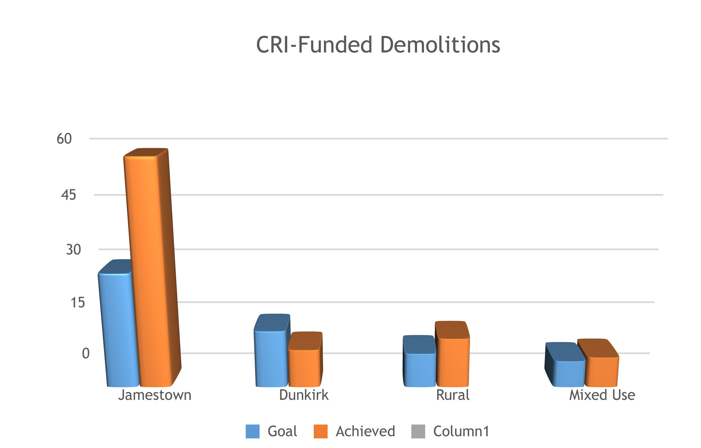
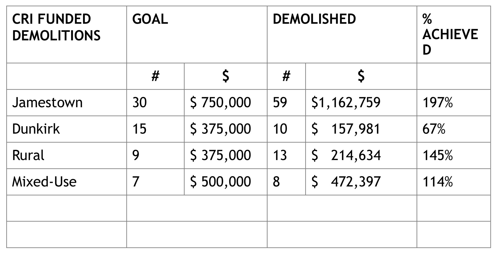
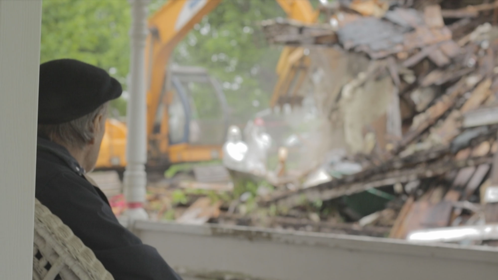

Impacting communities, strengthening neighborhoods, and improving the quality of life of individuals and families is a tall order, especially in a relatively small, rural, economically challenged region. It certainly cannot be accomplished without the vision and resourcefulness of community and government leaders committed to these ideals. And that is exactly what Chautauqua County has been pursuing through the efforts of the Chautauqua County Land Bank Corporation (CCLBC) and its stakeholders.

Our success is dependent on the collaboration of staff, board members, county and local government leaders, our non-profit partners and interested neighborhood community leaders. And of course, the financial support of the State Attorney General’s office, which we are very grateful for. As we commence our sixth year of operation, the CCLBC stands firm in our commitment to improve our local communities, one house at a time.

2017 emerged as a busy and productive year as we focused on performance metrics while strengthening internal controls and creating efficient and effective process improvements. Our numbers speak to the success of our efforts, with an additional 10 property Rehabs completed, representing over $400,000 in private reinvestment in their respective neighborhoods. Twenty (20) Rehab properties were sold in 2017, representing almost $1.2 million in assessed value that was returned to the county’s tax rolls and an additional $1.1 million in private reinvestment commitments.

We had the pleasure and privilege of hosting two members of AmeriCorps to work with the CCLBC in 2017. Amanda Mick and Miranda Strek-Greco served our program from December 2016-October 2017, as Outreach Coordinator and Program Assistant, respectively. Their stipends were funded through a grant from the Local Initiatives Support Corporation (LISC), and they made valuable contributions to our outreach and operations during their tenure. Amanda’s outreach efforts included working with a grassroots neighborhood alliance to beautify, and encourage participation and advocacy, in a transitional neighborhood. Our outreach was also enhanced by engaging with other housing agencies and community development partners to host an affordable housing forum to connect individuals with programs and help distinguish the program objectives of each organization to facilitate engagement. Miranda worked diligently on internal control objectives, drafting standard operating procedures for our program, compiling data for reporting and our data mapping project, and assisting with process improvement initiatives. Both AmeriCorps staff participated in the data collection to beta test our zombie house mobile application, and for the city of Dunkirk’s Housing Assessment and Neighborhood Revitalization Strategy.

A milestone reached in 2017 was the culmination of the Round 2 funding support from the Community Revitalization Initiative, which provided an additional $1.3 million to our initial $1.56 million grant support from the state to ramp up our land bank program. This funding from the Attorney General’s office, secured through the settlements negotiated with several major banking institutions following the mortgage crisis, established the Chautauqua County Land Bank Corporation and allowed us to build our program and our capacity to assist our local communities address the glut of vacant, unsafe, or unsightly residential and mixed-use properties across the county.  Following are some highlights of those efforts:

  

    
  

  

    
  

<!-- /.row -->

This funding also enabled the Land Bank to purchase 14 foreclosure properties from banks. These properties included: eight (8) zombie properties that had been abandoned and deteriorating for several years, driving down property values in decent neighborhoods; three (3) zombie properties that had deteriorated enough that they required demolition, (the community didn’t want to risk someone buying them as a sub-standard rental); and three (3) historic properties that the community requested the Land Bank acquire to ensure a responsible and appropriate renovation would occur. All three of the historic properties are currently undergoing thoughtful and historically relevant restorations.

Of course, the real indicator of our success are the impacts felt in the neighborhoods, in the lives of the homebuyers and their neighbors. We experience that regularly as we visit the communities around our county and talk to homeowners and prospective buyers.  The vast majority of feedback is very positive; long vacant or deteriorated homes brought back to life and the reinvestment breathing new life into the neighborhood. Investors who believe in a neighborhood stimulating a renewed commitment from other homeowners, and good people making their home the centerpiece of a fresh beginning.

# Tackling the issues of blight and its negative impacts requires a multi-pronged approach and the dedication of resources from the public, private and non-profit sectors. It also requires the engagement of our residents.

The State of NY has recognized the impacts that vacant, pre-foreclosure, aka “zombie” houses have on communities across the state. Therefore funding from mortgage crisis settlements was set aside to assist communities leverage the new state legislation that heightened accountability of banks that manage vacant homes through the foreclosure process. Both the city of Jamestown and the city of Dunkirk were recipients of funding in 2017 to help tackle the issue of “zombie” properties, or those properties left vacant due to a stagnant foreclosure process. This funding is significant in building the capacity of both cities to tackle the blight resulting from abandoned properties, and subsequently to help inform and augment the land bank’s efforts to address problem properties in both cities.

Dunkirk, as a result of this funding, was able to purchase new code enforcement software to enhance their ability to identify, track and enforce code violations that escalate when properties are vacant and neighborhoods are divested. Additionally this funding enabled the city to complete its first housing assessment and investment strategy. This study was completed with the generous assistance of many community members who were willing to catalog each and every house within the city of Dunkirk. The assessment categorizes every residence by its occupancy and overall condition, and provides the data to start tackling the incessant issue of zombie properties by identifying vacant abandoned properties and assisting the city to identify the bank owners who can be held accountable for deteriorating property conditions. The Assessment will be an invaluable resource that will inform public and private investments in the city’s housing stock, neighborhood revitalization efforts, and our land bank’s acquisition strategies and demolition targets.

Jamestown has taken an aggressive and innovative approach with their zombie grant funding, contracting with an attorney to assist in the identification of zombie properties and their responsible owners, and pursuing remedies for these properties through the furthest extent of the law. An innovative tax relief program was also developed to incentivize redevelopment of abandoned properties, and the land bank will help to coordinate property and purchaser matches for that program.

The Chautauqua County Land Bank continues to work diligently with local municipalities and residents to identify vacant and abandoned homes, to leverage resources to remove or repair blighted structures, to mobilize against zombies and irresponsible property owners, and advocate for legislative tools to maximize our effectiveness.  We applaud the local governments who proactively engage in the fight against blight with effective code enforcement, innovative community development initiatives, and thoughtful collaboration. We thank the County leaders who have supported the Land Bank concept and have helped establish and sustain the CCLBC. The assistance and support of our many vendors and sub-contractors, who often go above and beyond to help us achieve our mission.  Moreover, we thank the community members who have reached out to us, shared their concerns, their stories and their ideas, and invested in our Rehab projects.

Sincerely,

Gina Paradis

<a href="mission" class="btn btn-default btn-lg center-block">Our Mission <i class="fa fa-arrow-right"></i></a>
