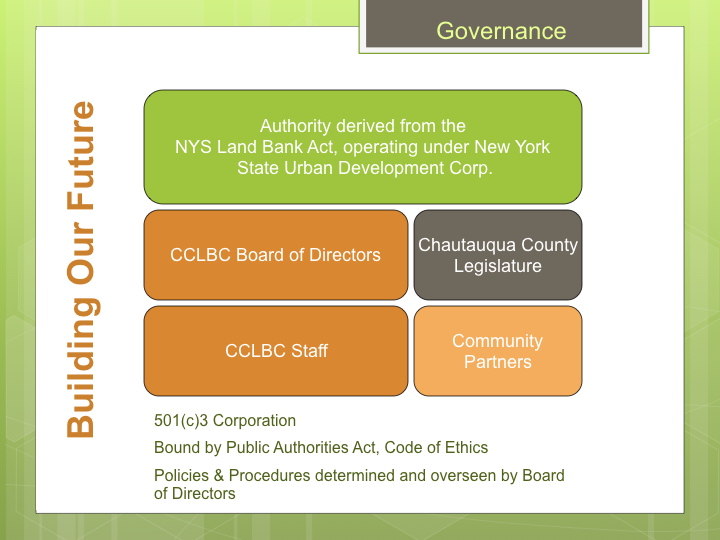
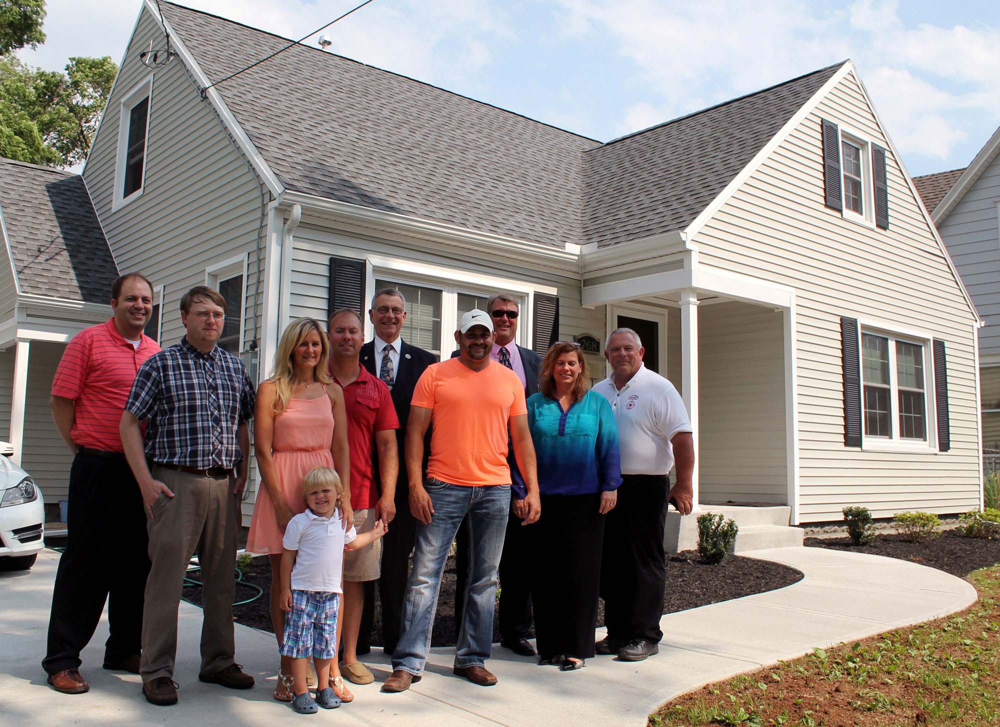

# CHAUTAUQUA COUNTY LAND BANK CORPORATION BOARD OF DIRECTORS

<strong>Board Profile:</strong>

The Chautauqua County Land Bank Corporation (CCLBC) is a Not-For-Profit (501 (c) 3) Corporation, formed to combat community deterioration by facilitating the return of vacant, abandoned and foreclosed homes to productive use, in order to eliminate the harms and liabilities caused by such properties, lessen the burden of local government, and act in the public interest.

The CCLBC has all the powers and duties as granted and governed by the following legislation:

* Article 16 of the Not-for-Profit Corporate Law of New York State
* 2010 Land Bank Law of New York State
* Public Authorities Act of New York State

The stated Mission of the CCLBC is to: “Control and manage strategically selected dilapidated and abandoned residential and commercial properties acquired through the County tax foreclosure process, bank foreclosures and/or donations, and facilitate solutions aimed at stabilizing neighborhoods, encouraging private investment, and improving the quality of life throughout Chautauqua County.”

The Board of the Chautauqua County Land Bank Corporation is composed of 11 members, appointed by the County Executive, subject to confirmation by the County Legislature. All Directors must be residents of or employed in Chautauqua County. Board members must be compliant with the governing legislation and regulatory requirements therein, including compliance with the NYS Accounting Budget Office’s requirements for financial disclosure, board training, and self-evaluation, as well as the Chautauqua County Code of Ethics. Board members are indemnified to the fullest extent under the Not-For-Profit Corporation Law of NYS.  The Board is governed by the corporation’s By-Laws as attached.

The Board of Directors are appointed to serve staggered terms. Representation currently includes two (2) members of the County Legislature, the County Real Property Tax Director, local representatives from the banking and real estate industries, community development organizations and the general public. We endeavor to be representative across the county.

Current Members of the Board include:

* James Caflisch; Real Property Tax Director, Chautauqua County				Board Chair
* Aaron Resnick; Executive Director, Westfield Development Corporation			Vice-Chair
* Nicole May; Compliance Officer, Lakeshore Bank						Secretary
* Hugh Butler; Organizational Development Consultant					Asst. Secretary
* Diane Hannum; Executive Director, Northern Chautauqua Community Foundation		Treasurer
* Bill Carlson; Realtor, Holt Howard Hanna							Asst. Treasurer
* John Hemmer; Legislator, Chautauqua County
* Paul Whitford; Legislator, Chautauqua County

There are currently three (3) openings on the board, created by vacancies due to relocations.

# Staff of the Chautauqua County Land Bank Corporation include:

* Gina Paradis; Executive Director
* Jennifer Cameron; Finance Manager (P/T)
* Mike Digirolamo; Project Manager (P/T)
* Steve Abdella and Allison Carrow; Attorneys [Legal Services are provided through a contract with the Chautauqua County Law Department]

# Standing Committees of the Board include:

* Acquisition/Disposition Committee – reviews potential acquisitions, donations and purchase proposals to recommend property acquisitions and dispositions to the full board.
* Governance Committee – reviews and makes recommendations to the full board relating to all issues of governance, including but not limited to board regulatory compliance, best practices, and membership. Also serves as the Nominating Committee for board officers.
* Finance – reviews and makes recommendations to staff and Board regarding the annual budget, grant funding, and financial accounting and compliance.
* Audit Committee – reviews and provides comment on the annual financial audit.

<a href="http://www.chautauqualandbank.org/" class="btn btn-default btn-lg center-block">View our Website <i class="fa fa-arrow-right"></i></a>
