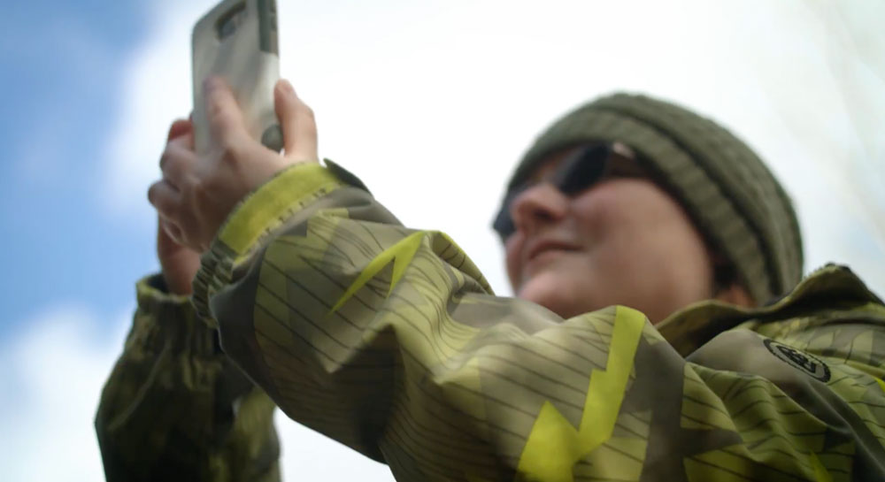
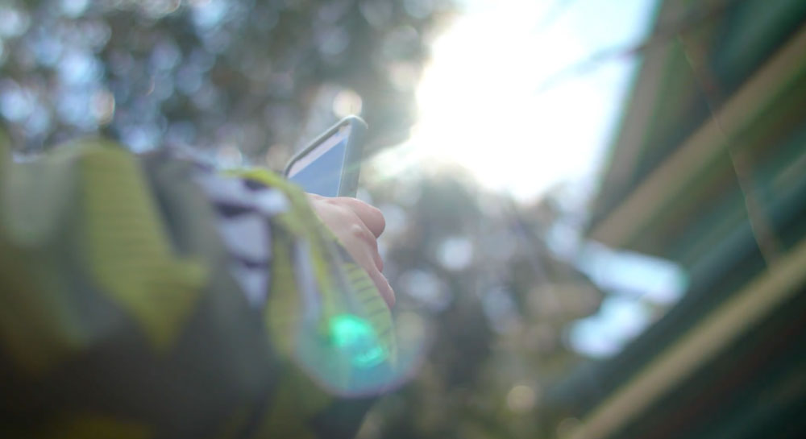
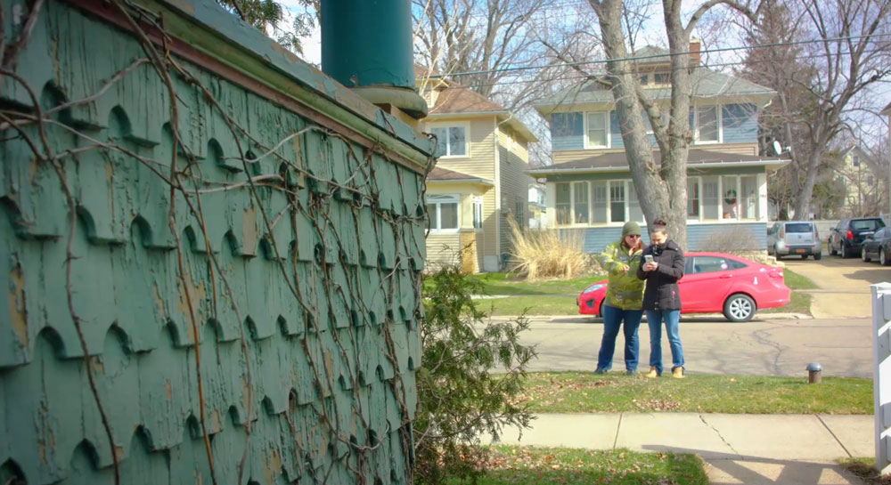
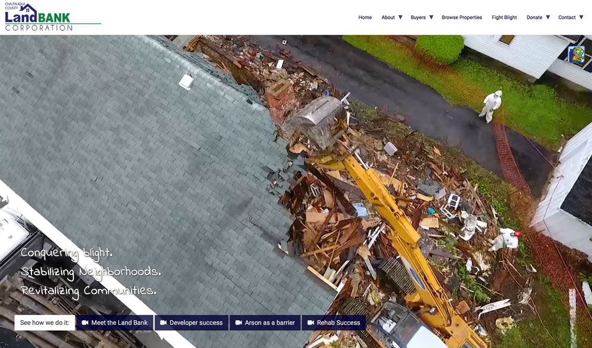
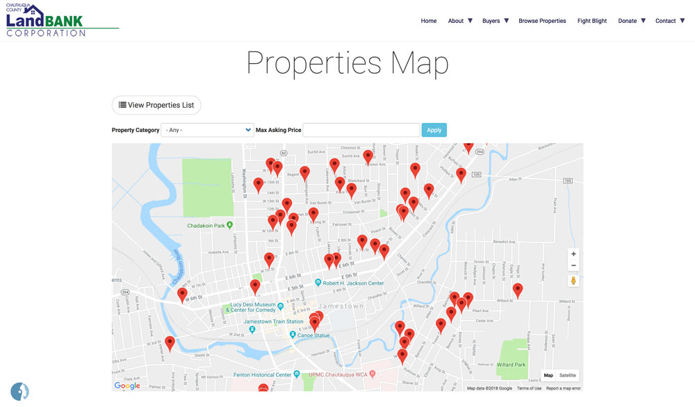

# 2017 Accomplishments

* Jim Caflisch, Director of Chautauqua County Real Property Tax Dept. is re-elected Chair of the CCLBC Board
* Hosted 2 AmeriCorps members who served the Land Bank for 8 months in the capacity of Program Assistant and Outreach Coordinator, through a grant from LISC (Local Initiatives Support Corporation).

  

  

  

<!-- /.row -->

* Assisted the City of Dunkirk with the field data work necessary to complete their Housing Assessment Study
* Assisted with the preparation and release of the NYS Report on Land Banks, the Center for Community Progress’s update on NYS Land Banks.
* Hosted an Affordable Housing Forum that provided information and access to local affordable housing programs in the county
* Successfully wrote $450,000 grant to subsidize renovations of 4 vacant, abandoned rental properties and transfer them to responsible local land lords willing to commit to 20 year affordable rents

  

    
  
  
  

    
0

    
  

  
Dollars in grants won to subsidize 4 sustainable rental property projects

* Initiated a project with Orbitist, a start-up marketing communications company who integrates data, geographic information systems (GIS), film and marketing communication strategies to help tell the story of impacts from vacancy and blight in our communities.

<a href="https://chqlandbank.org/node/add/blight_submission" target="blank" class="btn btn-default btn-lg center-block"><i class="fa fa-mobile"></i> Report Blight via Blight Tracking application made by Orbitist</a>

* Completion of the Round 2 Community Revitalization Initiative Grant Activities, which began in 2015.  Round 1 and Round 2 Funding supported the Land Bank’s initial operating budget from 2014-2017 with combined grant funding of $ 2.86 million derived from bank settlement monies from the mortgage crisis.
* Upgraded web site at www.CHQlandbank.org

  

  

<!-- /.row -->

* Secured grant and implemented work plan of Round 3 Community Reinvestment Initiative funding, representing $1.1 million for 2018 demolition and program support
* Acquired the legacy waterfront property known as HideAway Bay in Silver Creek in order to shepherd its redevelopment by competent and responsible parties. This represents the Land Bank’s first targeted economic development project.

<a href="outcomes" class="btn btn-default btn-lg center-block">Outcomes <i class="fa fa-arrow-right"></i></a>
